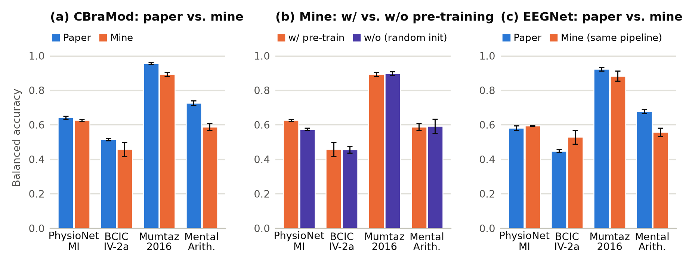

# CBraMod: released fine-tuning code on four public datasets

This experiment re-runs the downstream results of

> J. Wang et al., *CBraMod: A Criss-Cross Brain Foundation Model for EEG Decoding*, ICLR 2025

with the released code (`../../upstream`, commit `b9e9610`) and the released weights (HuggingFace
`weighting666/CBraMod`, md5 355de9c3…). Every number is the mean ± std over seeds 0–4, the same
number of seeds as the paper (which does not say which seeds it used). Runs were made on mcl-server
(8× Quadro M6000) on 2026-09-30 / 10-01.

The released pipeline has no test-set leakage: splits are subject-independent, the checkpoint is chosen
on the validation set, and the test set is scored once.

## Datasets

Of the paper's 13 downstream datasets, 6 are fully public. These 4 were run with the authors'
preprocessing; sample counts (train + val + test, from the first lines of the run logs) match the
paper's Table 1.

| Dataset | Task | Paper table | Samples | Subjects train / val / test |
|---|---|---|---|---|
| PhysioNet-MI | motor imagery, 4-class | 3, 4, 18 | 9,837 | 70 / 19 / 20 |
| BCIC-IV-2a | motor imagery, 4-class | 15 | 5,184 (current code), 5,088 (`@v0616`, as in the paper) | 5 / 2 / 2 |
| Mumtaz2016 | depression (MDD), 2-class | 10 | 7,143 | 43 / 9 / 11 |
| MentalArithmetic | mental stress, 2-class | 12 | 1,707 | 28 / 4 / 4 |

Not run: FACED (Synapse account), SEED-V and SEED-VIG (license application), SHU-MI (files are
password-protected), TUAB and TUEV (TUH registration), BCIC2020-3 (test labels not public, issue #32);
ISRUC and CHB-MIT are public but were too large for this round.

## Results

### CBraMod with the released weights vs. the paper

| Dataset (paper table) | Metric | Paper | Reproduced | Δ | p (Welch) | Paper: LaBraM-Base |
|---|---|---|---|---|---|---|
| PhysioNet-MI (T3) | balanced acc. | 0.6417 ± 0.0091 | 0.6265 ± 0.0054 | −0.0152 | 0.016 | 0.6173 |
| | Cohen's κ | 0.5222 ± 0.0169 | 0.5019 ± 0.0072 | −0.0203 | 0.053 | 0.4912 |
| | weighted F1 | 0.6427 ± 0.0100 | 0.6271 ± 0.0051 | −0.0156 | 0.021 | 0.6177 |
| BCIC-IV-2a (T15) | balanced acc. | 0.5138 ± 0.0066 | 0.4571 ± 0.0399 | −0.0567 | 0.033 | 0.4869 |
| | Cohen's κ | 0.3518 ± 0.0094 | 0.2762 ± 0.0532 | −0.0756 | 0.032 | 0.3159 |
| | weighted F1 | 0.4984 ± 0.0085 | 0.4138 ± 0.0673 | −0.0846 | 0.048 | 0.4758 |
| Mumtaz2016 (T10) | balanced acc. | 0.9560 ± 0.0056 | 0.8933 ± 0.0101 | −0.0627 | <0.001 | 0.9409 |
| | AUC-PR | 0.9923 ± 0.0032 | 0.9780 ± 0.0049 | −0.0143 | 0.001 | 0.9798 |
| | AUROC | 0.9921 ± 0.0025 | 0.9770 ± 0.0059 | −0.0151 | 0.003 | 0.9782 |
| MentalArithmetic (T12) | balanced acc. | 0.7256 ± 0.0132 | 0.5889 ± 0.0209 | −0.1367 | <0.001 | 0.6909 |
| | AUC-PR | 0.6267 ± 0.0099 | 0.5110 ± 0.1096 | −0.1157 | 0.077 | 0.5999 |
| | AUROC | 0.7905 ± 0.0073 | 0.7344 ± 0.0515 | −0.0561 | 0.071 | 0.7721 |

All 12 metrics come out below the paper. Table 15's column headers read "AUC-PR / AUROC" but hold
Cohen's κ / weighted F1 (author, issue #21).

### Pre-training, frozen backbone, and an EEGNet baseline (balanced accuracy)

| Dataset | Pre-trained | From scratch | Frozen backbone | EEGNet (same pipeline) | Paper: pre-trained / scratch / frozen / EEGNet |
|---|---|---|---|---|---|
| PhysioNet-MI | 0.6265 ± 0.0054 | 0.5738 ± 0.0082 | 0.5370 ± 0.0120 | 0.5948 ± 0.0028 | 0.6417 / 0.6196 / 0.3845 / 0.5814 |
| BCIC-IV-2a | 0.4571 ± 0.0399 | 0.4561 ± 0.0195 | – | 0.5288 ± 0.0394 | 0.5138 / – / – / 0.4482 |
| Mumtaz2016 | 0.8933 ± 0.0101 | 0.8973 ± 0.0115 | – | 0.8828 ± 0.0295 | 0.9560 / – / – / 0.9232 |
| MentalArithmetic | 0.5889 ± 0.0209 | 0.5924 ± 0.0403 | – | 0.5569 ± 0.0247 | 0.7256 / – / – / 0.6770 |

EEGNet-8,2 (`scripts/run_eegnet.py`) is trained through CBraMod's own loaders, Trainer, schedule and
model selection, so only the model differs. On BCIC-IV-2a it beats the reproduced CBraMod.

### Robustness checks

| Check | Balanced acc. |
|---|---|
| MentalArithmetic, code-default seed 3407 (n = 1) | 0.6146 |
| MentalArithmetic, lr 5e-4 without `multi_lr` (author's tip, issue #6) | 0.5361 ± 0.0560 |
| BCIC-IV-2a, data from the pre-A04T-fix preprocessing (`@v0616`, 5,088 samples) | 0.4446 ± 0.0186 |

None of these closes the gap to the paper. `results/results.txt` has every metric with per-seed values;
`results/results.json` has the same data, machine-readable.



## Settings

| Setting | Command-line difference from the released defaults (= paper Table 6) |
|---|---|
| `pretrained` | none |
| `scratch` | `--use_pretrained_weights ''` (`False` would parse as True: `type=bool`) |
| `frozen` | `--frozen True` (paper Table 18, "CBraMod (Fixed)") |
| `pt-lr5e-4-single` | `--lr 5e-4 --multi_lr ''` |
| `eegnet` | `scripts/run_eegnet.py` instead of `finetune_main.py` |
| `pretrained@seed3407` | `pretrained` with the code's default seed |
| `BCIC-IV-2a@v0616` | `pretrained` on data made by `scripts/preprocessing_bciciv2a_0616.py` |

## Layout

```
env/setup_env.sh                       conda env: Python 3.11.7 + PyTorch 2.1.2 (cu121), lmdb 1.4.1
env/pip_freeze.txt                     exact package versions of the runs
scripts/make_preproc.py                copies the released preprocessing, changing only paths and LMDB map_size
scripts/preprocessing_bciciv2a_0616.py released BCIC-IV-2a preprocessing at 0ff6be9 (before the A04T fix)
scripts/add_jobs.py                    queues finetune_main.py / run_eegnet.py jobs for tools/run_queue.py
scripts/run_eegnet.py                  EEGNet-8,2 through the released Trainer and loaders
scripts/collect.py                     parses run logs -> results.txt / results.json, with Welch tests vs. the paper
scripts/export_summary.py              results.json -> results/summary.csv (feeds the repo-wide RESULTS.md)
results/                               results.txt, results.json, summary.csv, fig_balanced_accuracy.png
logs/runs/<dataset>__<setting>__s<seed>/log.txt   full log of each of the 76 runs (CLI args on line 1)
logs/prep_*.log                        preprocessing logs
logs/queue.log                         start / end time of every job
```

The data downloader is shared at `../../../../datasets/download.sh`, the GPU queue at
`../../../../tools/run_queue.py`. The script that drew `fig_balanced_accuracy.png` was not kept; the
figure plots values from `results.json`.

## Reproducing

The tables can be recomputed from the committed logs with no GPU (numpy + scipy):

```bash
mkdir -p results_rerun
python scripts/collect.py logs/runs results_rerun > results_rerun/results.txt
diff results_rerun/results.txt results/results.txt     # identical; results.json may differ in the
                                                       # last digit of p-values across scipy versions
python scripts/export_summary.py results               # results/summary.csv from results/results.json
```

Re-running the training takes about 3 h on 8 M6000s (76 jobs; PhysioNet-MI pre-trained or from
scratch is the longest at ~68 min each). On a Linux GPU server:

```bash
git clone --recurse-submodules https://github.com/woo0kim/eeg-analysis-methods-review
cd eeg-analysis-methods-review/methods/cbramod/experiments/finetune-public-datasets

# 1. Environment and released weights (finetune_main.py loads them relative to the upstream dir)
bash env/setup_env.sh
wget https://huggingface.co/weighting666/CBraMod/resolve/main/pretrained_weights.pth \
     -O ../../upstream/pretrained_weights/pretrained_weights.pth

# 2. Data -> $EEG_DATA_ROOT (default ~/data)
for d in physio bciciv2a mumtaz mental; do ../../../../datasets/download.sh $d; done
python scripts/make_preproc.py                    # runnable copies in $CBRAMOD_WORK/preprocessing
cd ${CBRAMOD_WORK:-~/repro}/preprocessing
for s in physio bciciv2a mumtaz stress; do python preprocessing_$s.py; done   # stress = MentalArithmetic
cd -
python scripts/preprocessing_bciciv2a_0616.py     # only for the @v0616 check

# 3. Queue the 76 runs and start one worker per GPU
for ds in PhysioNet-MI BCIC-IV-2a Mumtaz2016 MentalArithmetic; do
  for st in pretrained scratch eegnet; do python scripts/add_jobs.py $ds $st 0 1 2 3 4; done
done
python scripts/add_jobs.py PhysioNet-MI frozen 0 1 2 3 4
python scripts/add_jobs.py MentalArithmetic pt-lr5e-4-single 0 1 2 3 4
python scripts/add_jobs.py BCIC-IV-2a@v0616 pretrained 0 1 2 3 4
python scripts/add_jobs.py MentalArithmetic pretrained 3407
python ../../../../tools/run_queue.py 0 1 2 3 4 5 6 7   # touch $CBRAMOD_WORK/queue/STOP to stop

# 4. Collect, then compare with results/
python scripts/collect.py ${CBRAMOD_WORK:-~/repro}/runs results_rerun > results_rerun/results.txt
```

Paths come from environment variables whose defaults are the layout the logged runs used:
`EEG_DATA_ROOT` (`~/data`), `CBRAMOD_WORK` (`~/repro`; runs, queue and preprocessing copies),
`CBRAMOD_PY` (`~/miniforge3/envs/cbramod/bin/python`) and `CBRAMOD_SRC` (`../../upstream`).
`tools/run_queue.py` reads `RUN_QUEUE_DIR` (`~/repro/queue`); set it to `$CBRAMOD_WORK/queue` if you
move `CBRAMOD_WORK`.

Checkpoints (~6 GB) are not in the repo; they were left on mcl-server under `~/repro/runs/*/ckpt`.
In `logs/queue.log`, 10 jobs at the start failed within seconds and were re-run; all 76 final runs exited 0.

## Provenance

Moved here on 2026-10-03 from the local `CBraMod/validation_artifacts/` folder, which had no git history.
Changes on the move: hard-coded `~/CBraMod`, `~/repro` and `~/data` paths became the environment
variables above (same defaults), `dl_one.sh` became `datasets/download.sh`, `run_queue.py` moved to
`tools/`, `setup_env.sh` now also pins lmdb 1.4.1, and `scripts/export_summary.py` was added.
